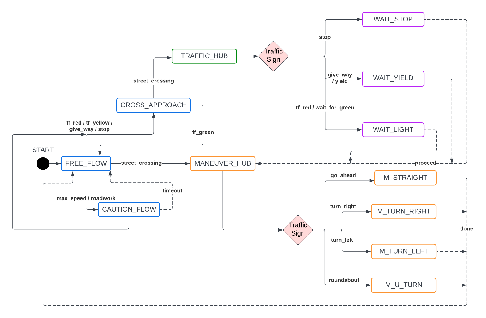

# puzzlebot_controller

---

## Overview

The `puzzlebot_controller` package serves as the final decision-making and execution layer of the autonomous navigation stack. It translates high-level semantic intelligence into precise kinetic commands. Unlike a simple reactive system, this package implements a **Behavior-Based Control** architecture. By utilizing a **Multi-threaded Finite State Machine (FSM)**, the robot seamlessly switches between cruising, obeying traffic laws, and performing complex maneuvers at intersections while maintaining robust PID-based steering.

---

## Behavioral Logic & Control Architecture

Rather than a static, linear pipeline, this package operates as a **State-Driven Decision Engine**. It constantly evaluates the robot's "context"—which includes detected navigation targets, traffic signs, and internal timers—to select the most appropriate kinetic behavior. This ensures that navigation is not just about staying on the road, but about **contextual awareness**, allowing the robot to understand and react to environmental constraints in real-time.

---

## File Structure & Data Flow

### Core Control
*   **`controller/puzzlebot_controller.hpp`**: The central hub for robot motion. It provides the shared interface for all states to exercise control over the hardware, embedding the core logic for following a `navigation_target` via PID-based steering.
*   **`controller/steering_controller.hpp`**: Handles the low-level calculation of linear ($v$) and angular ($\omega$) velocities to ensure smooth trajectory tracking.

### State Machine Framework
*   **`state_machine/state.hpp`**: An abstract class (interface) defining the lifecycle of a behavior through `on_entry`, `on_execute`, and `on_exit` methods.
*   **`state_machine/state_machine.hpp`**: A dedicated ROS 2 node that manages the active state, handling transition logic and execution cycles at a fixed frequency (10Hz).
*   **`state_machine/all_states.hpp`**: The comprehensive registry containing the definitions of all robot behaviors (e.g., `FreeFlow`, `WaitStop`, `MTurnRight`).

### System Utilities
*   **`utils/chronometer.hpp`**: A utility for non-blocking temporal events, allowing states to trigger precise timeouts without halting the main execution thread.
*   **`utils/robot_context.hpp`**: A thread-safe "blackboard" that stores the latest perception data (traffic signs, lights, directions), making it accessible across the entire system.

### Integration & Execution
*   **`navigator_system.hpp`**: The primary integration node. It subscribes to `/path_interpreter/results` and `/traffic_sign_tracker/results`, owning the FSM and injecting perception events to update the `RobotContext`.
*   **`main.cpp`**: The system orchestrator. It handles node composition (injection), resource allocation, and explicitly defines the **Transition Map** that governs how the robot moves between states.

---

## Finite State Machine (FSM)
<p align="center">
  
</p>
<p align="center">
  <em>Real-time traffic sign tracking mounted on the Puzzlebot platform.</em>
</p>


The robot's behavior is governed by a transition-based logic map:

### 1. Flow & Perception States
*   **`FREE_FLOW`**: Default high-speed navigation. It transitions to `CROSS_APPROACH` when signs infer an upcoming intersection (e.g., traffic lights or directional signs) or to `CAUTION_FLOW` upon detecting warnings.
*   **`CAUTION_FLOW`**: Reduced speed state for roadwork or speed zones. It returns to `FREE_FLOW` after a 3.5s timeout but can also transition to `CROSS_APPROACH` if intersection-related signs are detected.
*   **`CROSS_APPROACH`**: Preparation for an intersection. It decreases speed and monitors for a `street_crossing` to enter the `TRAFFIC_HUB`. It features an **early escape**: if a green light is detected, it returns to `FREE_FLOW` as speed reduction is no longer necessary.

### 2. Decision Hubs
*   **`TRAFFIC_HUB`**: Evaluates traffic priority at the stop line. It redirects to `WAIT_STOP`, `WAIT_YIELD`, or `WAIT_LIGHT`. This is the critical "decision point" where the robot commits to a intersection.
*   **`MANEUVER_HUB`**: Triggered at intersections to execute a specific direction (`M_STRAIGHT`, `MTurnLeft`, `MTurnRight`, or `MUTurn`) based on the directional sign identified previously.

### 3. Action & Wait States
*   **`WAIT_STOP`**: Performs a mandatory 3-second full stop.
*   **`WAIT_LIGHT`**: Holds position until a green light (`tf_green`) is detected.
*   **`WAIT_YIELD`**: A probabilistic wait state that checks for cross-traffic before proceeding.
    *   *Note: These three states always transition to the `MANEUVER_HUB` once conditions are met.*
*   **`M_STRAIGHT / M_TURN / M_U_TURN`**: Kinetic maneuvers that **pause line-following** to perform open-loop, timed movements. All return to `FREE_FLOW` upon completion (`done`).

---

### State Interaction Model

Each state follows a consistent structure:

- **Reads:** `RobotContext`  
- **Acts on:** `PuzzlebotController`  
- **Generates:** Events such as `timeout`, `done`, or `proceed`  

---

## ROS 2 Interface

### Topics
| Topic                          | Type         | Description                                                      |
| :----------------------------- | :----------- | :--------------------------------------------------------------- |
| `/path_interpreter/results`    | Subscription | Navigation vectors and steering angles for the controller.       |
| `/traffic_sign_tracker/results`| Subscription | Semantic sign detection (Stop, Yield, Lights, Directions).       |
| `/cmd_vel`                     | Publisher    | Final velocity commands sent to the robot hardware.              |

---

## How to Run

The package includes a comprehensive launch file that initializes the entire navigation stack (Perception + Control).

**Launch the full system:**
```bash
ros2 launch puzzlebot_controller nav_system.launch.py device_type:=cuda debug:=true
```
> **Note:** Using `device_type:=cuda` is highly recommended for robots equipped with NVIDIA hardware to ensure real-time YOLOv8 inference performance.

**Run the controller node individually:**
```bash
ros2 run puzzlebot_controller navigator_node
```

