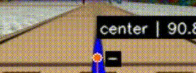

# road_perception

This repository contains the semantic perception and road geometry system for the Puzzlebot platform. Essentially, this system is a highly evolved line-follower that replaces basic intensity sensing with a complex "vision-based" logic to calculate navigation corrections. It transforms a real-time camera stream into actionable navigation targets (steering commands) using computer vision techniques and spatial gradient analysis.

---

## Overview

The `path_interpreter` node acts as the central orchestrator, processing camera frames to identify lanes, lines and crosswalks. This module has undergone the most significant transformation during development:

- **Evolution of the Logic**  
  The original implementation (6th semester project) was fragile, simply selecting the line closest to the center of the Region of Interest (ROI), which frequently failed during sharp turns.

- **The Tracking Phase**  
  A later version introduced a tracker to avoid confusion between lines. However, because road lines lack distinct unique descriptors, the system remained vulnerable to losing the line or requiring an extremely perfect controller.

- **Current Robust Logic**  
  The current system is much more intelligent and independent. Instead of just following a line, it leverages the geometric shape of the track and its proximity to the image background to dynamically classify whether a line is Center, Right, or Left. This makes the module robust enough to handle the road infrastructure without requiring the robot to start in a specific position.


<p align="center">
  
</p>
<p align="center">
  <em>Real-time path interpreter mounted on the Puzzlebot platform.</em>
</p>

---

## Perception Pipeline

The system processes visual information through a modular sequence designed to refine raw pixels into semantic road data:

1. **LAB Segmentation**  
   Road features are extracted using the LAB color space, providing high robustness against varying lighting conditions.

2. **Component Extraction**  
   Segmented pixels are grouped and converted into functional "Road Components" (lines or objects).

3. **Edge Proximity & Semantic Analysis**  
   By analyzing lateral gradients and spatial proximity, the system performs "geometric profiling" to classify road types. 

4. **Target Calculation**  
   The classified geometry is used to generate a `steering_angle` and navigation targets.

5. **Results Publishing**  
   The node continuously broadcasts the processed data using the `RoadPerception.msg` from the `puzzlebot_interfaces` package. 

6. **Visualization**  
   If debug mode is enabled, the pipeline renders control vectors and masks for real-time telemetry.

---

## File Structure & Data Flow

The `road_perception` package is architected as a streamlined pipeline that transforms raw pixel data into high-level semantic intelligence:

---

### Core Logic

**`road_segmenter/road_component.py` (Geometric Abstraction)**  
Defines the `RoadComponent` class, acting as a bridge between raw pixels and geometric entities. It encapsulates spatial properties like centroid, area, aspect ratio, and orientation, allowing the system to treat lines and crosswalks as objects with distinct physical traits.

---

**`road_segmenter/road_segmenter.py` (Feature Extraction)**  
Handles low-level vision tasks using the LAB color space to isolate road markings while remaining robust against shadows. It implements morphological operations, and connected component analysis to filter visual noise.

---

**`scene/scene_parser.py` (Semantic Interpretation)**  
The "brain" of the package. It performs lateral gradient analysis and "line profiling" to determine the scene hierarchy. By analyzing spatial proximity to road boundaries, it classifies lines as Left, Right, or Center, allowing the robot to orient itself independently of its starting position.

---

**`scene/navigation_target.py` (Motion Planning)**  
Translates the interpreted scene into motion commands. It generates a `NavigationTarget` by calculating the `steering_angle` and decomposing the direction into longitudinal (`x`) and lateral (`y`) vector components for the robot's controller.

---

### Support & Utilities

**`utils/perception_context.py` (Global State)**  
A Singleton that ensures all modules share a unified configuration, including camera dimensions, ROI parameters, and robot egocentric coordinates, ensuring consistency across the pipeline.

---

**`utils/primitives.py` (Math Foundation)**  
Defines base data structures (Points, Vectors, Rectangles) and mathematical transformations required for spatial analysis, keeping the core logic focused on high-level tasks.

---

**`utils/road_visualizer.py` (Telemetry)**  
Essential for debugging. When enabled, it projects metadata and navigation vectors onto the video stream, rendering color-coded contours and directional intent for real-time verification.

---

## ROS 2 Interface

### Parameters

| Parameter | Type | Description |
|----------|------|------------|
| `debug`  | bool | When True, enables debug logging and publishes the processed_image stream |

---

### Topics

| Topic                              | Type          | Description |
|-----------------------------------|--------------|------------|
| `camera/image_raw`                | Subscription | Raw BGR8 input stream from the camera |
| `path_interpreterd/results`         | Publisher    | Semantic navigation output (`RoadPerception.msg`) |
| `path_interpreter/processed_image`| Publisher    | Debug visualization (only active in debug mode) |

---

## Output Message

The custom `RoadPerception` message provides the following high-level intelligence:

- **Target Detected**  
  Boolean status indicating if a valid path is visible.

- **Steering Angle**  
  The calculated angle in radians required to follow the path.

- **Vector Components**  
  Functional approximations where `x` represents forward distance and `y` represents lateral displacement relative to the image center.

- **Crosswalk Detection**  
  A boolean flag used to trigger specific behaviors in navigation state machines.

---

## How to Run

To launch the road perception system with visual debugging enabled:

```bash
ros2 run road_perception path_interpreter --ros-args -p debug:=True
```

`Note:` The debug parameter defaults to False for optimal production performance.

---