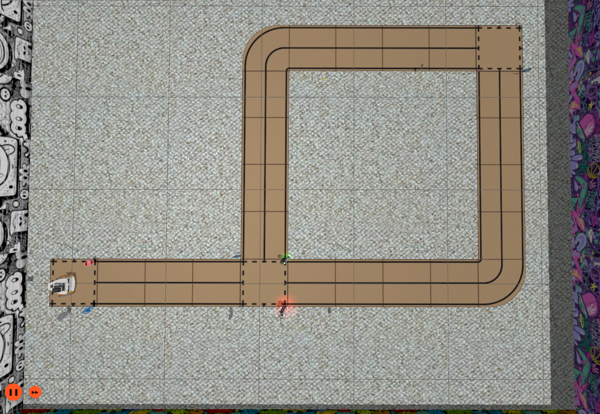

# ros_gz_puzzlebot_gazebo

This package acts as the integration layer for the entire simulation environment, designed to replicate the physical components and tracks used during a 6th-semester university robotics project. 

## Overview
The primary goal is to provide a high-fidelity environment that mimics real-world conditions for testing robotics algorithms. This includes the implementation of a modular track system and interactive infrastructure like smart traffic lights.

<p align="center">
  
</p>

## How to Use
The package includes two main launch strategies:

*   **Standard World Launch**: The `start_puzzlebot_world.launch.py` script initializes the Gazebo engine and loads the world geometry. This is a "static" launch that does not include the robot by default but supports the `world` argument for environment selection.
*   **Orchestrated Launch**: The `main_puzzlebot_lab.launch.py` acts as the master orchestrator. It triggers the world launch while simultaneously utilizing `ros_gz_puzzlebot_bringup` to publish the robot description and spawn the Puzzlebot entity into the environment.

### Execution
To run the simulation, follow the standard build and source procedure (note that environment variables update automatically via workspace hooks):
```bash
# Build and source the workspace
colcon build
source install/setup.bash

# Launch the full simulation with the default or specified world
ros2 launch ros_gz_puzzlebot_gazebo main_puzzlebot_lab.launch.py world:=puzzletrack_v1.sdf
```

`Note`: Use the world argument to select between different available tracks defined in the package.


## Models and Infrastructure
The package defines several categories of models to populate the simulation world:

### Traffic Signage
A comprehensive set of standard traffic signs used for computer vision and detection tasks. These models are designed for integration with detection algorithms like YOLOv8 and include various regulatory, warning, and directional signs.

### Modular "Puzzletrack" System
The track is constructed using a modular system known as Puzzletrack, allowing for diverse patterns and layouts:

- `Piece 1`: Straight track segment.

- `Piece 2`: Intersection.

- `Piece 3`: Curved segment.

### Traffic Lights
The simulation includes a traffic_light model that follows the strict naming and hierarchy conventions required by the traffic_light_plugin submodule. This allows for synchronized, timed transitions directly within the Gazebo environment.

## World Environments
The package provides pre-configured worlds located in the /worlds directory:

- `puzzletrack_v1`: A near-exact replica of the original physical track used in university, with slight modifications to demonstrate improved navigation and localization algorithms.

- `puzzletrack_v2`: A significantly more complex layout designed for advanced stress-testing of path-planning and sign-recognition logic.

